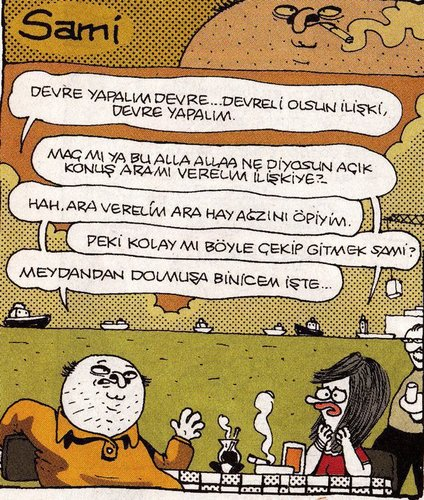
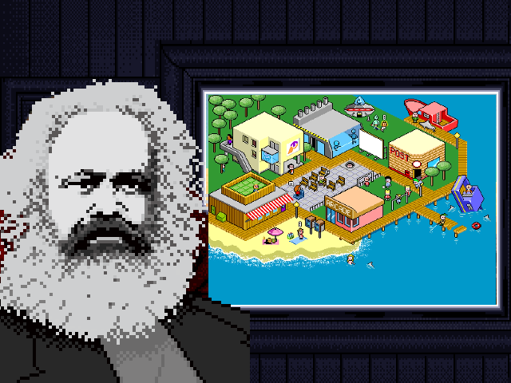
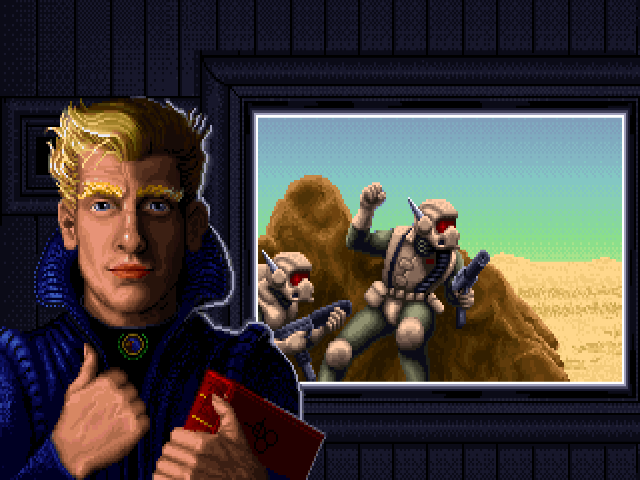
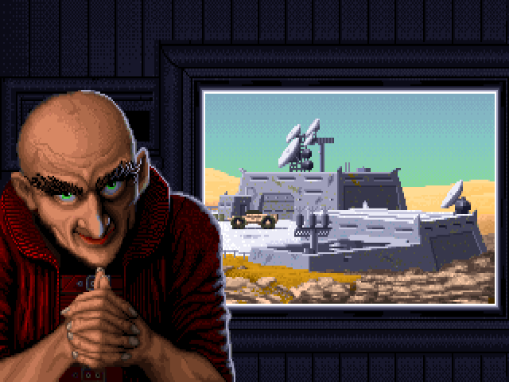
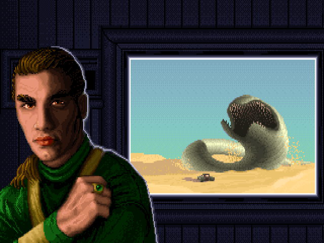

# Geleceğin Türkiyesi - Oyun

| 🚧 Uyari: Bu yarim kalmis bir projedir. Oynanabilir bir oyun barindirmaz. 🚧 |
| --- |

Bu proje https://github.com/pemre/gelecegin-turkiyesi icinde yer alan önerileri hayata gecirebileceginiz bir oyun konseptidir.

## Öyküsü

Secimlerde sizin partiniz cogunluk oyu alarak kazanmis. Hangi tür partiyle Türkiye'yi yoneteceksiniz? Amacin duz adam Sami'yi (ve belki bir duz kadin karakter) ve tum Türkiye'yi maksimum huzur seviyesine cikartmak.

## Politik parti secenekleri

4 farkli yonetim biciminden birini sec:

| Sosyalist | Devletci | Merkez Sag | Liberal |
| --- | --- | --- | --- |
|  |  |  |  |
